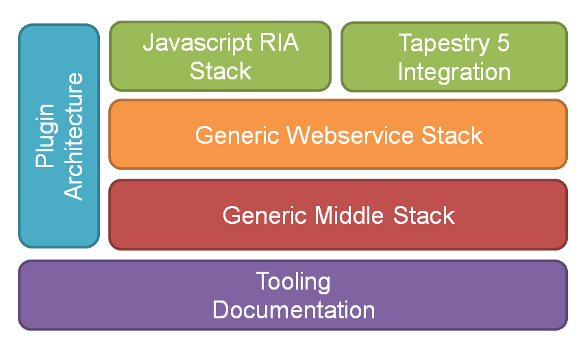

===============
Getting started
===============

RESThub can be used with any MVC framwork, but is designed to provide th perfect backend for `RESThub JS <http://resthub.org/javascript/>`_, a Javascript framework designed to build lightweight HTML5 applications.

We also provide a `Tapestry 5 <http://tapestry.apache.org/>`_ integration for those who prefer serverside MVC frameworks.  

Requirements
============

Before coding, you should download and install following development tools if needed : 
 * `Java 6 <http://java.sun.com/javase/downloads/index.jsp>`_
 * `Maven 3 <http://maven.apache.org/>`_
 * A java IDE like `Eclipse <http://www.eclipse.org/>`_ or `Netbeans <http://netbeans.org/>`_ is recommanded

Project templates 
=================

The easiest way to start is to use RESThub archetypes to create your first RESThub based application. Just open a command line terminal, and type :

.. code-block:: bash

	mvn archetype:generate -DarchetypeCatalog=http://resthub.org/nexus/content/repositories/releases/

You will have to choose between 3 RESThub archetypes :

* **resthub-archetype-js-webapp** : simple HTML5/Javascript web application
* **resthub-archetype-tapestry5-webapp** : simple RESThub based Tapestry 5 web application
* **resthub-archetype-jar-module** : a JAR module for inclusion in your multi modules project
 
You can run your webapps thanks to builtin mvn jetty:run support.  

Documentation
=============

In addition to this reference documentation, RESThub Javadoc is available `here <http://resthub.org/javadoc/1.1>`_.

Framework documentation included in RESThub may also be useful :
 * `Maven complete reference <http://www.sonatype.com/books/mvnex-book/reference/public-book.html|Maven by example]], [[http://www.sonatype.com/books/mvnref-book/reference/public-book.html>`_
 * `Spring 3 reference manual <http://static.springsource.org/spring/docs/3.0.x/spring-framework-reference/html|html]], [[http://static.springsource.org/spring/docs/3.0.x/spring-framework-reference/pdf/spring-framework-reference.pdf>`_
 * `Spring 3 javadoc <http://static.springsource.org/spring/docs/3.0.x/javadoc-api/>`_
 * `Hibernate documentation <http://www.hibernate.org/docs.html>`_
 * `Hades <http://hades.synyx.org/static/2.x/site/org.synyx.hades/apidocs/>`_
 * `H2 embedded database <http://www.h2database.com/html/main.html>`_

Sample applications
===================

Check these sample applications to learn how to design your RESThub based web application :
 * `Roundtable <https://github.com/pullrequest/resthub/tree/resthub-1.1/resthub-apps/roundtable>`_ : a doodle like clone developed with RESThub JS.
 * `Booking JS <https://github.com/pullrequest/resthub/tree/resthub-1.1/resthub-apps/booking/booking-js/>`_ : booking demo application, implemented with RESThub JS.
 * `Booking Tapestry 5 <https://github.com/pullrequest/resthub/tree/resthub-1.1/resthub-apps/booking/booking-tapestry5/>`_ : booking demo application, implemented with Tapestry 5 integration.

In order to test and run one of these applications :
 * Download RESThub sources from https://github.com/pullrequest/resthub/tree/resthub-1.1
 * Open command line, and go to one of
	* resthub/resthub-apps/booking/booking/booking-tapestry5
	* resthub/resthub-apps/booking/booking/booking-js
	* resthub/resthub-apps/roundtable
 * Run mvn jetty:run
 * Open your browser and go to http://localhost:8080

Debugging web application
=========================

Run/Debug RESThub in Eclipse :
 * Right click on kazan-portal module -> Debug As -> Maven Build ...
 * Name : Debug myproject
 * Goal : mvn -Denv=local jetty:run
 * Click on Apply, then Run
 * Open your browser with following URL : `http://localhost:8080/ <http://localhost:8080/>`_
 * Go to Debug Perspective
 * Right click on the Debug window -> Edit source lookup
 * Add -> Java project -> Select all -> OK -> OK
