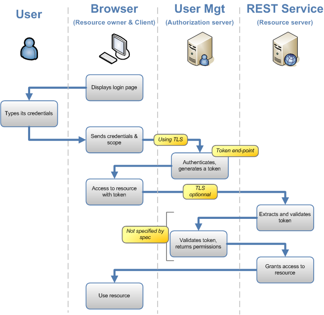

.. highlight:: java

========================
OAuth2 based AuthN/AuthZ
========================

Introduction
============

RESThub provide provider and client for `OAuth2 protocol <http://tools.ietf.org/html/draft-ietf-oauth-v2>`_, and more specifically with its `password grant type <http://tools.ietf.org/html/draft-ietf-oauth-v2-16#section-4.3>`_ :
 * A java authorization server layer, which you have to plug ahead your centralized accounting service.
 * A java servlet resource server filter, which must be deployed on each services
 * A javascript client toolkit, to performs authorization request, stores tokens, enrich further calls with those tokens, and manage security protocol errors. More details are available in `RESThub JS reference documentation <http://resthub.org/1.1/javascript/oauth2.html>`_.

The workflow is the following :

In a chronologic order:
 * the javascript toolkit will helps you perform the authorization request, with your user credentials.
 * the autorization server layer will delegate to our accounting service the authentication part.
 * once the user authenticated, the authorization server layer will returned a time-limited token
 * the javascript toolkit will stores this token, and enrich your further calls to the REST services.
 * on each REST services, the resource server filter will check the token validity, by requesting the central accounting service.
 * the autorization server layer will delegate to out accounting service the retrieving of the user permissions, related to the incoming token. For further calls, results will be stored in a Memcache's distributed  cache.
 * the resource server filter will enrich a spring security "Principal" object with the retrieved permission, allowing you to managed our business security.
 * you can access to the authenticated user id, stored in a request header "user_id"

OAuth2 provider
===============

RESThub use `Spring Security OAuth2 implementation <http://static.springsource.org/spring-security/oauth/oauth2.html>`_ on serverside.

In order to use it, add this dependency in your pom.xml :

.. code-block:: xml

		<dependency>
			<groupId>org.resthub</groupId>
			<artifactId>resthub-oauth2-spring-security</artifactId>
			<version>1.1</version>
		</dependency>

And here is a sample configuration to be added in your applicationContext.xml :

.. code-block:: xml

	<security:authentication-manager>
		<security:authentication-provider user-service-ref="myUserDetailsService" />
	</security:authentication-manager>
	
	<security:http entry-point-ref="oauth2ProcessingFilterEntryPoint">
		<security:access-denied-handler ref="oauth2AccessDeniedHandler" />
		<security:intercept-url pattern="api/**"/>
	</security:http>
	
	<bean id="oauth2AccessDeniedHandler" class="org.springframework.security.web.access.AccessDeniedHandlerImpl"/>	
	<bean id="tokenServices" class="org.springframework.security.oauth2.provider.token.InMemoryOAuth2ProviderTokenServices" />

	<oauth2:provider client-details-service-ref="clientDetails" token-services-ref="tokenServices" >
		<oauth2:verification-code disabled="true"/>
	</oauth2:provider>
		
	<oauth2:client-details-service id="clientDetails" >
		<oauth2:client clientId="myClientID" authorizedGrantTypes="password" />
	</oauth2:client-details-service>
	
You will also have to add theses lines to your web.xml, bellow the contextConfigLocation context-param block :

.. code-block:: xml

	<filter>
		<filter-name>springSecurityFilterChain</filter-name>
		<filter-class>org.springframework.web.filter.DelegatingFilterProxy</filter-class>
	</filter>
	<filter-mapping>
		<filter-name>springSecurityFilterChain</filter-name>
		<url-pattern>/*</url-pattern>
	</filter-mapping> 
	<filter>
		<filter-name>JpaFilter</filter-name>
		<filter-class>org.springframework.orm.jpa.support.OpenEntityManagerInViewFilter</filter-class>
	</filter>

You can have look to Booking or Identity manager sample application to see how it works.

OAuth2 client
=============

You will certainly have communications between protected resource services.
If you choose to use tokens between your protected service, as described in the (TODO) server-to-server profile, we provide you some utilities to do that.

In your "client" resource server:

* Add a maven dependency to org.resthub:resthub-oauth2-client.jar
* In your Dao/Service beans, use the TokenRepository utility class.

This class stores in memory tokens you may need to access as many protected resource as you want.
You have to configure it:

* By indicating some Authorization servers urls : just a list of string passed to setAuthenticationServices() (you can also use Spring injection by declaring a bean in xml)
* By indicating a client id and client secret. Thoses "client credentials" are NOT end-user credentials, and must be known by your authorization services. TokenRepository will use them to authenticate and obtain token to the desired resource.

**WARNING** - For this first release, client id/secret ARE end-user credential, so you need a "Technical user" in your authorization service that will represent your java clients//**

You can use in many ways this utility class:

* Just with enrich(). When enrich() will be invoked, existing token will be used, or if no token are available, a token will be automatically asked.
* With obtain(), add() and enrich(). Manually gets your token with obtain(), keeps it with add(), and it will be used when enrich() will be invoked.
* With add(), and consult(). Sets your token manually with addToken(), and retrieves them furtherly with consult(). you will just use TokenRepository as an in-memory storage space, and you will have to enrich yourself your requests

Some example?
Spring bean definition

.. code-block:: xml

	<bean name="tokenRepository" class="org.resthub.oauth2.client.TokenRepository">
		<property name="clientId" value="foo"/>
		<property name="clientSecret" value="bar"/>
		<property name="authorizationEndPoints">
			<list>
				<value>http://XXX.XXX.XXX.XXX:YYY/oauth/authorize</value>
			</list>
		</property>
	</bean>

Java code:

.. code-block:: java

	@Inject
	protected TokenRepository tokenRepository;
	
	// Enrich and trigger a request.
	String resourceName = "/myResource";
	HttpClient httpClient = ClientFactory.create();
	XXX result = tokenRepository.enrich(httpClient.path(resourceName)).get(XXX.class);
	
